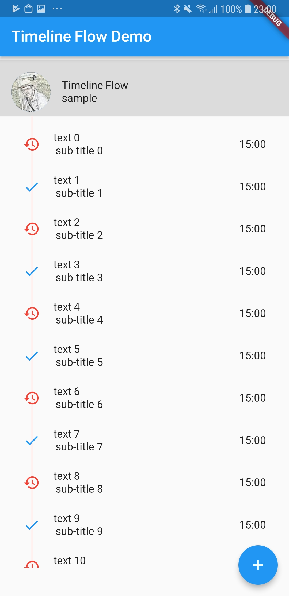

# timeline_flow

A flutter package to create timeline flow;

Usage:

@override
  Widget build(BuildContext context) {
    return new Scaffold(
      appBar: new AppBar(
        title: new Text(widget.title),
      ),
      body: Column(
        children: <Widget>[
          Image.asset( 'assets/foto_face.jpg',height: 50.0,width: 50.0,),
          TimelineProfile(
              image: AssetImage( 'assets/foto_face.jpg'),
              title: Text('Timeline Flow'),
              subTitle: Text('sample'),
              color: Colors.black12,
              ),
          Expanded(child:Stack(
            children: <Widget>[
              TimelineView.builder( bottom: 40.0, left: 30.0, leftLine: 45.0, bottomLine:40.0,  itemCount: 20, itemBuilder: (index){
                return TimelineTile(
                  title: Text('text $index',),
                  subTitle: Text(' sub-title $index'),
                  icon: Icon( (index.isEven?Icons.history:Icons.check),color: (index.isEven?Colors.red:Colors.blue),),
                  gap: 0.0,
                  trailing: Text('15:00'),
                  );
              }),
            ],
          )),
        ],
      ),
      floatingActionButton: new FloatingActionButton(
        onPressed: _incrementCounter,
        tooltip: 'Increment',
        child: new Icon(Icons.add),
      ), // This trailing comma makes auto-formatting nicer for build methods.
    );
  }

     